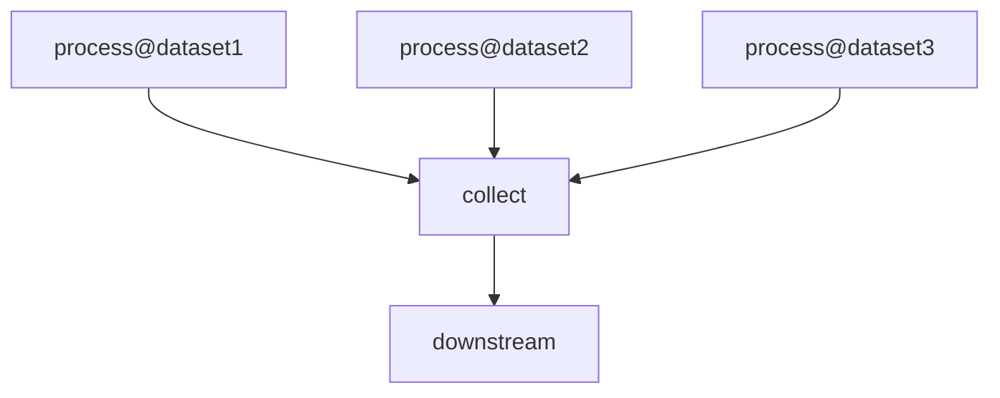

```console
dvc dag --md --mermaid
```


```mermaid
flowchart TD
	node1["collect"]
	node2["downstream"]
	node3["process@dataset1"]
	node4["process@dataset2"]
	node5["process@dataset3"]
	node1-->node2
	node3-->node1
	node4-->node1
	node5-->node1
```
